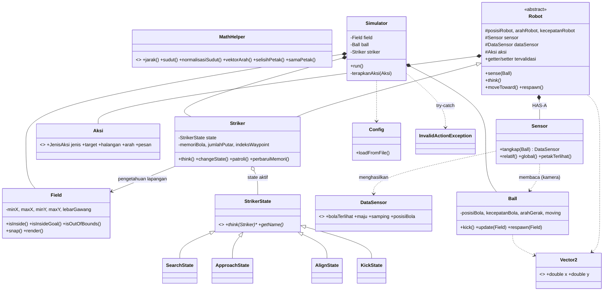
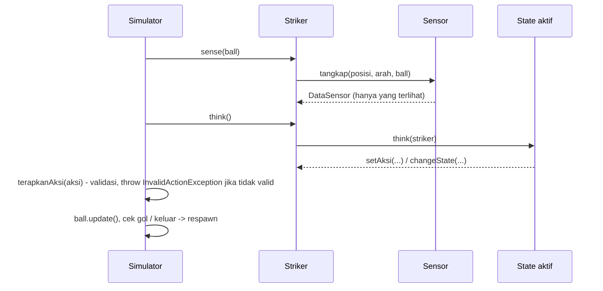

# Class Diagram - Ichiro KPP Day 1

```mermaid
classDiagram
    class Vector2 { <<struct>> +double x +double y }
    class MathHelper { <<helper Vector2.h>> +jarak() +sudut() +normalisasiSudut() +vektorArah() +selisihPetak() +samaPetak() }
    class Field {
        -minX, maxX, minY, maxY, lebarGawang
        +isInside() +isInsideGoal() +isOutOfBounds()
        +snap() +render()
    }
    class Ball {
        -posisiBola, kecepatanBola, arahGerak, moving
        +kick() +update(Field) +respawn(Field)
    }
    class DataSensor { <<struct>> +bolaTerlihat +maju +samping +posisiBola }
    class Sensor {
        +tangkap(Ball) DataSensor
        +relatif() +global() +petakTerlihat()
    }
    class Aksi { <<struct>> +JenisAksi jenis +target +halangan +arah +pesan }
    class Robot {
        <<abstract>>
        #posisiRobot, arahRobot, kecepatanRobot
        #Sensor sensor
        #DataSensor dataSensor
        #Aksi aksi
        +sense(Ball)
        +think()* 
        +moveToward() +respawn()
        +getter/setter tervalidasi
    }
    class Striker {
        -StrikerState state
        -memoriBola, jumlahPutar, indeksWaypoint
        +think() +changeState() +patroli() +perbaruiMemori()
    }
    class StrikerState { <<abstract>> +think(Striker)* +getName()* }
    class SearchState
    class ApproachState
    class AlignState
    class KickState
    class Simulator {
        -Field field
        -Ball ball
        -Striker striker
        +run()
        -terapkanAksi(Aksi)
    }
    class Config { +loadFromFile() }
    class InvalidActionException

    Robot <|-- Striker
    StrikerState <|-- SearchState
    StrikerState <|-- ApproachState
    StrikerState <|-- AlignState
    StrikerState <|-- KickState
    Robot *-- Sensor : HAS-A
    Robot *-- Aksi
    Sensor ..> DataSensor : menghasilkan
    Sensor ..> Ball : membaca (kamera)
    Striker o-- StrikerState : state aktif
    Striker --> Field : pengetahuan lapangan
    Simulator *-- Field
    Simulator *-- Ball
    Simulator *-- Striker
    Simulator ..> Config
    Simulator ..> InvalidActionException : try-catch
    Robot ..> Vector2
    Ball ..> Vector2
```

## Alur satu tick (Sense - Think - Act)

```mermaid
sequenceDiagram
    participant Sim as Simulator
    participant R as Striker
    participant S as Sensor
    participant St as State aktif
    Sim->>R: sense(ball)
    R->>S: tangkap(posisi, arah, ball)
    S-->>R: DataSensor (hanya yang terlihat)
    Sim->>R: think()
    R->>St: think(striker)
    St-->>R: setAksi(...) / changeState(...)
    Sim->>Sim: terapkanAksi(aksi) - validasi, throw InvalidActionException jika tidak valid
    Sim->>Sim: ball.update(), cek gol / keluar -> respawn
```
